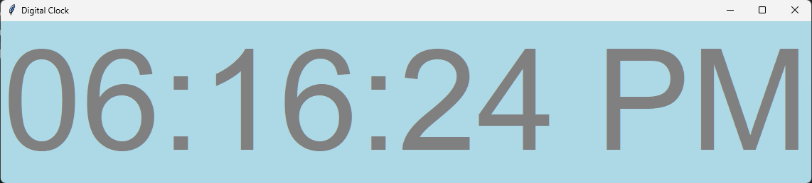

# 🕰️ Digital Clock using Tkinter

This is a simple **digital clock** application built using Python's `Tkinter` library for the graphical user interface and the `time` module to display the current time. The clock is updated every second and shows the time in a 12-hour format with AM/PM.

## 🌟 Features

- Displays the current time in a 12-hour format (with AM/PM).
- Uses `Tkinter` for a simple and customizable graphical user interface.
- Time updates every second.
- Adjustable fonts, background, and text colors.
- Lightweight and easy to run.

## 📋 Requirements

- Python 3.x (Ensure Python is installed on your machine)
- `Tkinter` (Usually bundled with Python, no additional installation needed)

### Key Parts:
- **`time.strftime("%I:%M:%S %p")`**: Formats the time into a 12-hour format with seconds and AM/PM.
- **`digi_clock.config(text=display_time)`**: Updates the label text with the current time.
- **`digi_clock.after(200, present_time)`**: Recursively updates the time every 200ms to make sure the clock runs in real-time.

## 🎨 Customization

You can customize the appearance of the clock by changing the font, background color, and text color. Here are the options:
- **Font**: Change the `"Arial"` to any font of your choice.
- **Background color**: Change `"Light blue"` to any color you like.
- **Text color**: Change `"gray"` to any other color that suits your design.

## 📸 Screenshot

## 📝 License

This project is open-source and available under the MIT License. Feel free to fork or contribute!

## 📣 Contributing

If you have any suggestions or improvements, feel free to open an issue or submit a pull request. All contributions are welcome! 😄

---

🔧 **Enjoy using your digital clock!** 🕰️
